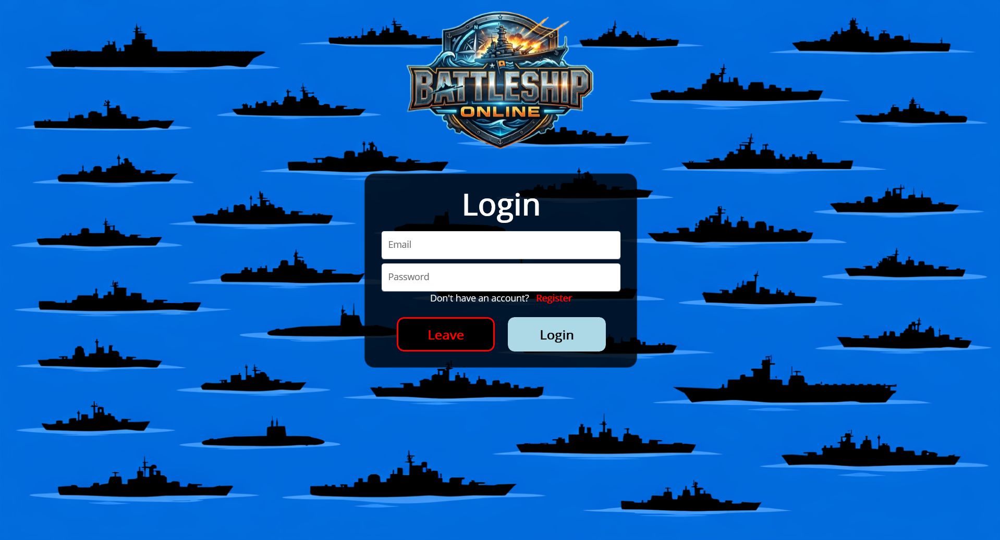
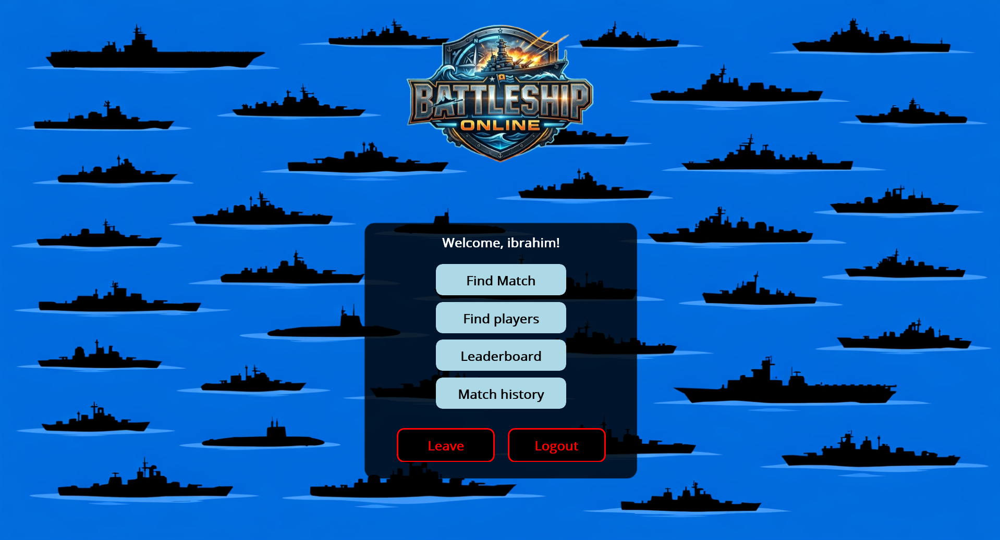
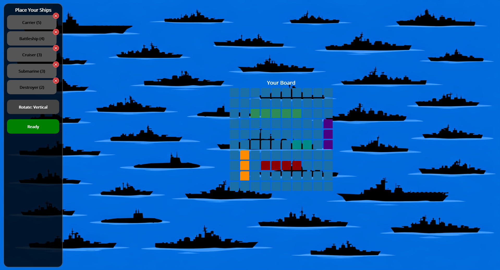
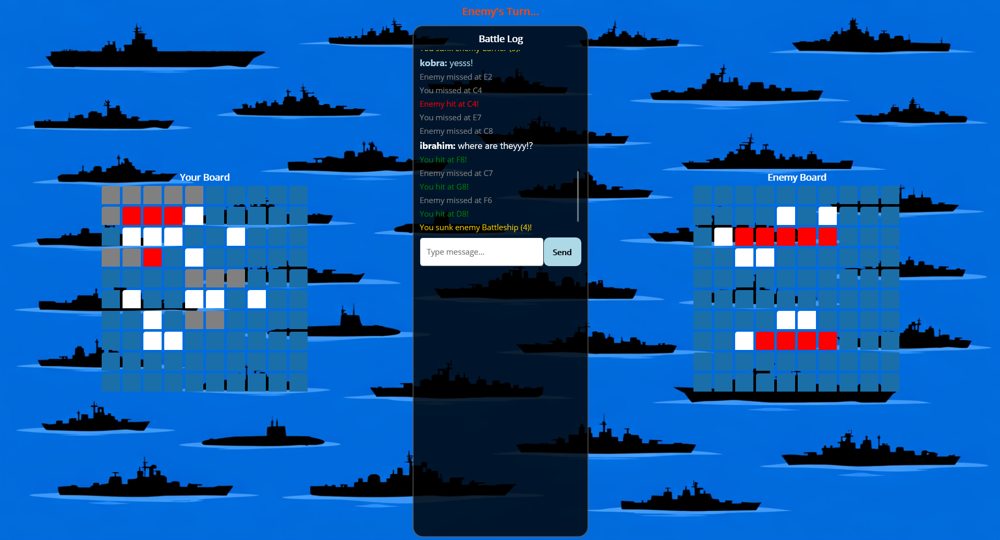
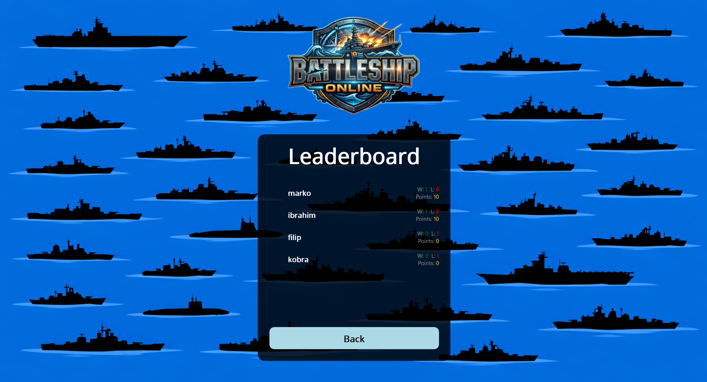

# Online Battleship
### Проектна задача по предметот Визуелно програмирање

**Изработиле:**
- Филип Јовановски 241218
- Ибрахим Феризи 241525

---

## Опис на проектот

Online Battleship е мултиплатформска онлајн игра за двајца играчи, изработена во .NET MAUI (клиент) и ASP.NET Core + SignalR (сервер). Играчите се регистрираат, се логираат и можат да се најдат преку matchmaking систем или да се предизвикаат директно. Откако ќе се поврзат, секој играч ги поставува своите бродови на 10x10 табла, а потоа наизменично пукаат еден на друг сè додека еден од нив не ги потопи сите бродови на противникот.

---

## Технологии

**Клиент:**
- .NET MAUI (Windows и Android)
- SignalR Client
- C#

**Сервер:**
- ASP.NET Core Web API
- SignalR
- Entity Framework Core
- PostgreSQL
- Railway (deployment)

---

## Функционалности

- Регистрација и логирање
- Листа на играчи со онлајн статус
- Matchmaking (автоматско пронаоѓање противник)
- Challenge систем (директно предизвикување играч)
- Поставување бродови на 10x10 табла со различни бои по тип
- Turn-based gameplay со индикатор кој е на ред
- Hit/Miss визуелизација на двете табли
- Battle log со информации за погодоци и потопени бродови
- Chat во реално време за време на игра
- Leaderboard (ранг листа по победи)
- Match History (историја на натпревари)

---

## Структура на проектот

```
Online-Battleship/
├── Online-Battleship/          # MAUI клиент
│   ├── Models/                 # Cell, Ship, Board, Game, Log, User
│   ├── Services/               # ApiService, HubService, SessionService, AppConfig
│   └── Views/                  # LoginPage, RegisterPage, MainPage, PlayersPage,
│                               # LeaderboardPage, MatchHistoryPage, MatchPage,
│                               # ShipPlacementPage, GamePage
└── OnlineBattleship.Server/    # ASP.NET Core сервер
    ├── Controllers/            # AuthController, PlayersController, MatchHistoryController
    ├── Data/                   # AppDbContext
    ├── DTOs/                   # AuthDTOs
    ├── Hubs/                   # GameHub (SignalR)
    ├── Migrations/             # EF Core миграции
    ├── Models/                 # User, Match
    └── Services/               # AuthService
```

---

## Модели

**Cell** — едно поле на таблата со состојба: Empty, Ship, Hit, Miss.

**Ship** — брод со тип (Carrier, Battleship, Cruiser, Submarine, Destroyer), големина, број на погодоци и листа на клетки кои го зафаќа.

**Board** — 10x10 табла со листа на бродови. Содржи логика за поставување бродови, примање удари и проверка дали сите бродови се потопени.

**Game** — тековна игра со два играчи, нивните табли, тековен потег и состојба (WaitingForPlayers, PlacingShips, InProgress, Finished).

**Log** — порака во battle log-от со тип (System, Chat, Shot), испраќач и временска ознака.

---

## Тек на играта

```
Login / Register
       ↓
   Main Menu
       ↓
Match (Matchmaking) или Challenge Player
       ↓
  Match Found
       ↓
 Place Ships (10x10 табла)
       ↓
  Battle Started
       ↓
 Turn-based пукање
       ↓
   Game Over
       ↓
Leaderboard + Match History
```

---

## Сервер и база

Серверот е хостиран на **Railway** и користи **PostgreSQL** база. Комуникацијата помеѓу клиентот и серверот се одвива преку:

- **REST API** за регистрација, логирање, листа на играчи, leaderboard и историја
- **SignalR** за реално-временска комуникација (matchmaking, поставување бродови, пукање, chat)

За промена на серверскиот URL, се менува само `AppConfig.cs`:

```csharp
public static string ServerUrl = "https://вашиот-url.railway.app";
```

---

## Слики

**Login страница:**



**Main Menu:**



**Поставување бродови:**



**Играње:**



**Leaderboard:**



---

## Покренување локално

### Сервер

1. Клонирај го репото
2. Отвори `OnlineBattleship.Server` во Visual Studio
3. Постави connection string во `Program.cs` или преку environment variable `CONNECTION_STRING`
4. Стартувај го серверот

### Клиент

1. Отвори `Online-Battleship` во Visual Studio
2. Во `Services/AppConfig.cs` постави го серверскиот URL
3. Стартувај на Windows или Android

---

## Поделба на работата

| Дел | Изработил |
|-----|-----------|
| MAUI UI (сите Views/XAML) | Филип |
| Game Logic (Models) | Филип, Ибрахим |
| ASP.NET Core Server | Ибрахим |
| SignalR GameHub | Ибрахим |
| PostgreSQL + EF Core | Филип, Ибрахим |
| Railway Deployment | Филип |
| Services (ApiService, HubService, SessionService) | Ибрахим |
| Sound Effects | Филип |
